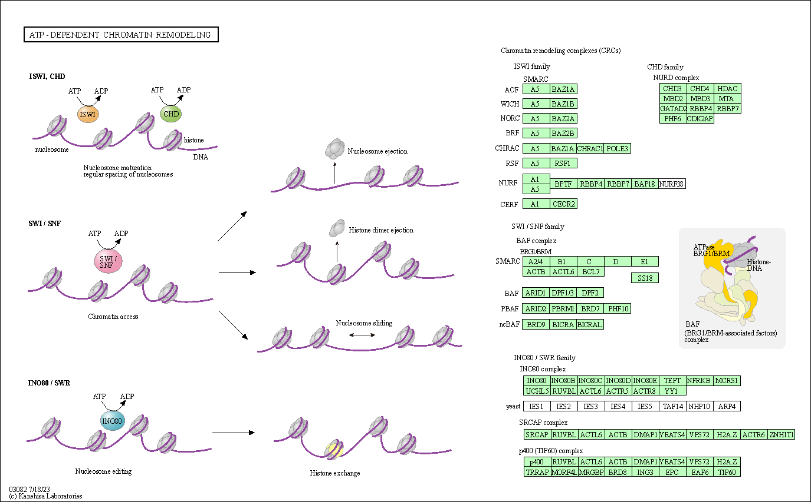

# Dataset

- Processed RNA-Seq data for 9265 tumor samples across 24 cancer types from The Cancer Genome Atlas from [1].

- Clinical data for 1247 samples and methylation data for 885 samples with breast cancer from The Cancer Genome Atlas from [2].

# Code availiability

Project code is available on GitHub at the link: https://github.com/ikeyko/breast_cancer_subtypes

# Dataset preparation

## Clinical data

Loading of clinical data from excel table
```{r}
clinicaldata.breast = read.csv("data/raw/clinical", sep = "\t")
```

Since clinical data contains a huge number of fields, we will leave only the ones we need:
```{r}
clinicaldata.breast = clinicaldata.breast[ , c("sampleID", "Age_at_Initial_Pathologic_Diagnosis_nature2012",
                                                                 "histological_type", "pathologic_stage")]
colnames(clinicaldata.breast) = c("sampleID", "age", "histological_type", "pathologic_stage")

clinicaldata.breast
```

We begin by conducting an exploratory analysis of clinical data. Consider first the distribution of data by histological types
```{r}
library(ggplot2)
clinicaldata.breast |> 
  ggplot(aes(`histological_type`, fill = `histological_type`)) + 
  geom_bar() + 
  ggtitle('Distribution of different histological types') + 
  geom_text(aes(label = after_stat(count)), stat = 'count', vjust = 0) +
  theme(axis.text.x = element_text(angle = 90, vjust = 0.5, hjust=1)) +
  ylim(0,1000)
```

The most common subtypes of breast cancer are *Infiltrating Ductal Carcinoma* and *Infiltrating Lobular Carcinoma*.  
Further consider the distribution of data by cancer stage.
```{r}
clinicaldata.breast |> 
  ggplot(aes(`pathologic_stage`, fill = `pathologic_stage`)) + 
  geom_bar() + 
  ggtitle('Distribution of different pathologic stages') + 
  geom_text(aes(label = after_stat(count)), stat = 'count', vjust = 0) +
  theme(axis.text.x = element_text(angle = 90, vjust = 0.5, hjust=1))
```

The data also contains information about various sub-stages, as well as uncertainties and inconsistencies in the data.  
Further consider the distribution of data by age.
```{r}
clinicaldata.breast |> 
  ggplot(aes(`age`)) + 
  geom_bar() + 
  ggtitle('Distribution of ages at initial pathologic diagnosis')
```
The bulk of the studied patients are concentrated at the age of 40 to 80 years.  

Since the main goal of the study is to detect genetic differences between the two main subtypes of breast cancer, we will separate samples with these subtypes from others, as well as get rid of uncertainties and inconsistencies.

Filter samples only for two histology types:
```{r}
histology_names = c("Infiltrating Ductal Carcinoma", "Infiltrating Lobular Carcinoma")
clinicaldata.breast.filtered = clinicaldata.breast[clinicaldata.breast$histological_type %in% histology_names, , drop = FALSE]
clinicaldata.breast.filtered$histological_type = chartr(" ", "_", clinicaldata.breast.filtered$histological_type)
```

Combine stages and delete groups with small number of samples
```{r}
clinicaldata.breast.filtered$pathologic_stage[clinicaldata.breast.filtered$pathologic_stage == "Stage IA" | clinicaldata.breast.filtered$pathologic_stage == "Stage IB"] = "Stage I"
clinicaldata.breast.filtered$pathologic_stage[clinicaldata.breast.filtered$pathologic_stage == "Stage IIA" | clinicaldata.breast.filtered$pathologic_stage == "Stage IIB"] = "Stage II"
clinicaldata.breast.filtered$pathologic_stage[clinicaldata.breast.filtered$pathologic_stage == "Stage IIIA" | 
                                         clinicaldata.breast.filtered$pathologic_stage == "Stage IIIB" | 
                                         clinicaldata.breast.filtered$pathologic_stage == "Stage IIIC"] = "Stage III"
clinicaldata.breast.filtered =  clinicaldata.breast.filtered[clinicaldata.breast.filtered$pathologic_stage %in% c("Stage I", "Stage II", "Stage III", "Stage IV"), ]
clinicaldata.breast.filtered = clinicaldata.breast.filtered[order(clinicaldata.breast.filtered$histological_type),]
```

```{r}
clinicaldata.breast.filtered |> 
  ggplot(aes(`pathologic_stage`, fill = `histological_type`)) + 
  geom_bar(position = "dodge") + 
  ggtitle('Distribution of different pathologic stages') + 
  geom_text(aes(label = after_stat(count)), stat = 'count', position = position_dodge(1)) +
  theme(axis.text.x = element_text(angle = 90, vjust = 0.5, hjust=1))
```

```{r}
# grouped boxplot
ggplot(clinicaldata.breast.filtered, aes(x=`pathologic_stage`, 
                                         y=`age`, 
                                         fill=`histological_type`)) + 
    geom_boxplot()+ 
    ggtitle('Age of patients at each pathological stage\nwith different cancer subtypes')
```

The mean age of patients in each group is almost the same and is about 60 years. In addition, there are practically no samples of the Infiltrating Lobular Carcinoma in the stage IV group, so this group can be excluded from the analysis for lack of information.
```{r}
clinicaldata.breast.filtered = clinicaldata.breast.filtered[!clinicaldata.breast.filtered$pathologic_stage %in% c("Stage IV"), ]
rownames(clinicaldata.breast.filtered) = clinicaldata.breast.filtered$sampleID
clinicaldata.breast.filtered = clinicaldata.breast.filtered[-1]
clinicaldata.breast.filtered
```

## RNA-seq data

Reading the second table from raw data set:
```{r}
read_count = read.delim("data/raw/GSM1536837_06_01_15_TCGA_24.tumor_Rsubread_FeatureCounts.txt", header = TRUE, sep = "\t", dec = ".")
```

Transform data frame before merging whole data together:
```{r}
names.use <- names(read_count)[(substr(names(read_count), 1,15)%in% gsub("-", ".", rownames(clinicaldata.breast.filtered)))]
rownames = read_count$X
read_count <- read_count[, names.use]
rownames(read_count) = rownames
colnames(read_count) = colnames(read_count)
read_count
```

## Methylation data

Load methylation data (BRCA only)
```{r}
methyldata = read.delim("data/raw/breast/methy", header = TRUE, sep = " ", dec = ".")
```

Check if the samples id from methyldata data exist in sample ids list that we need
```{r}
read_count.ids = chartr("-", ".",colnames(read_count))
names.use <- names(methyldata)[(names(methyldata) %in% substr(read_count.ids, 1, 15))]
methyldata.subset <- methyldata[, names.use]
colnames(methyldata.subset) = chartr(".", "-",colnames(methyldata.subset))
methyldata.subset
```

## Merge multi-omics data (RNA expression, methylation and clinical data)

Some of the samples contain data from different times (before and after treatment), so we need to keep only the earliest data.
```{r}
# extract column names of the data frames
cols_df_1 <- paste(chartr("-", ".", rownames(clinicaldata.breast.filtered)),'A', sep ="")
cols_df_2 <- substr((names(read_count)), 1 , 16)

# find the intersection of both column name vectors
cols_difference <- setdiff(cols_df_1, cols_df_2)
cols_intersection <- intersect(cols_df_1, cols_df_2)

cols_difference2 = paste(substr((cols_difference), 1 , 15), "B", sep = "")
cols_intersection2 <- intersect(cols_difference2, cols_df_2)

cols_intersection = c(cols_intersection, cols_difference2)

read_count.subset = read_count[substr((names(read_count)), 1 , 16) %in% cols_intersection]

# subset the initial data frames
drop_columns = c("TCGA.A7.A13D.01A.13R.A277.07", "TCGA.A7.A13E.01A.11R.A277.07", "TCGA.A7.A26E.01A.11R.A277.07", "TCGA.A7.A26J.01A.11R.A277.07")
read_count.subset = read_count.subset[ -which(names(read_count.subset) %in% drop_columns)]

#countData = countData.filtered
names(read_count.subset) = chartr(".", "-", substr(names(read_count.subset), 1 , 15))
read_count.subset
```

Adjust samples to clinical data
```{r}
clinicaldata.breast.filtered = clinicaldata.breast.filtered[match(colnames(read_count.subset), rownames(clinicaldata.breast.filtered)), ]
```

Merge transcriptomics and epigenetics datasets together
```{r}
names.use <- names(read_count.subset)[names(read_count.subset) %in% names(methyldata.subset)]
read_count.methyl <- read_count.subset[, names.use]
```

Merge whole dataset with clinical data
```{r}
names.use <- rownames(clinicaldata.breast.filtered)[rownames(clinicaldata.breast.filtered) %in% names(methyldata.subset)]
clinicaldata.breast.filtered.methyl <- clinicaldata.breast.filtered[rownames(clinicaldata.breast.filtered) %in% names.use, ]
```

Consider how the data distribution looks like in the final dataset.
```{r}
clinicaldata.breast.filtered.methyl |> 
  ggplot(aes(`pathologic_stage`, fill = `histological_type`)) + 
  geom_bar(position = "dodge") + 
  ggtitle('Distribution of different pathologic stages after whole data merging') + 
  geom_text(aes(label = after_stat(count)), stat = 'count', position = position_dodge(1)) +
  theme(axis.text.x = element_text(angle = 90, vjust = 0.5, hjust=1))
```

The distribution of histological types by stages proportionally does not differ much (from two to four times)

```{r}
# grouped boxplot
ggplot(na.omit(clinicaldata.breast.filtered.methyl), aes(x=`pathologic_stage`, 
                                         y=`age`, 
                                         fill=`histological_type`)) + 
    geom_boxplot()+ 
    ggtitle('Age of patients at each pathological stage\nwith different cancer subtypes after whole data merging')
```

We will not remove NA values from patient age as there is no correlation between age and other data and these data will not be used in further analysis.  

## Downsampling

```{r}
clinicaldata.breast.filtered.methyl |> 
  ggplot(aes(`histological_type`, fill = `histological_type`)) + 
  geom_bar() + 
  ggtitle('Distribution of different histological types before downsampling') + 
  geom_text(aes(label = after_stat(count)), stat = 'count', vjust = 0) +
  ylim(0,550)
```

The data in each group is not balanced. To obtain better results in subsequent analyses, we equalize the number of samples in each of the study groups using $downsampling()$ function from $caret$ library.
```{r}
library(caret)
clinicaldata.breast.filtered.methyl.d = clinicaldata.breast.filtered.methyl[ , c("histological_type", "pathologic_stage", "age"), drop = FALSE]
clinicaldata.breast.filtered.methyl.d$sample_id = rownames(clinicaldata.breast.filtered.methyl.d)
clinicaldata.breast.filtered.methyl.d$histological_type = as.factor(clinicaldata.breast.filtered.methyl.d$histological_type)

set.seed(123)
clinicaldata.breast.filtered.methyl.d <- downSample(clinicaldata.breast.filtered.methyl.d, clinicaldata.breast.filtered.methyl.d$histological_type)
rownames(clinicaldata.breast.filtered.methyl.d) = clinicaldata.breast.filtered.methyl.d$sample_id
clinicaldata.breast.filtered.methyl.d = clinicaldata.breast.filtered.methyl.d[ , c("histological_type", "pathologic_stage", "age"), drop = FALSE]
clinicaldata.breast.filtered.methyl.d = clinicaldata.breast.filtered.methyl.d[order(row.names(clinicaldata.breast.filtered.methyl.d)), , drop = FALSE]
clinicaldata.breast.filtered.methyl.d
```

```{r}
clinicaldata.breast.filtered.methyl.d |> 
  ggplot(aes(`histological_type`, fill = `histological_type`)) + 
  geom_bar() + 
  ggtitle('Distribution of different histological types after downsampling') + 
  geom_text(aes(label = after_stat(count)), stat = 'count', vjust = 0) +
  ylim(0,200)
```

```{r}
clinicaldata.breast.filtered.methyl.d |> 
  ggplot(aes(`pathologic_stage`, fill = `histological_type`)) + 
  geom_bar(position = "dodge") + 
  ggtitle('Distribution of different pathologic stages after downsampling') + 
  geom_text(aes(label = after_stat(count)), stat = 'count', position = position_dodge(1)) +
  theme(axis.text.x = element_text(angle = 90, vjust = 0.5, hjust=1))
```
```{r}
# grouped boxplot
ggplot(na.omit(clinicaldata.breast.filtered.methyl.d), aes(x=`pathologic_stage`, 
                                         y=`age`, 
                                         fill=`histological_type`)) + 
    geom_boxplot()+ 
    ggtitle('Age of patients at each pathological stage\nwith different cancer subtypes after downsampling')
```
After downsampling our data looks more balanced in each group.

Adjust sample size in transcriptomics and epigenetics data.
```{r}
names.use <- names(methyldata.subset)[names(methyldata.subset) %in% rownames(clinicaldata.breast.filtered.methyl.d)]
methyldata.subset.d <- methyldata.subset[ ,names(methyldata.subset) %in% names.use]
methyldata.subset.d
```
```{r}
names.use <- names(read_count.methyl)[names(read_count.methyl) %in% rownames(clinicaldata.breast.filtered.methyl.d)]
read_count.methyl.d <- read_count.methyl[ ,names(read_count.methyl) %in% names.use]
read_count.methyl.d
```

## Save data in file

Export transcriptomics data to file:
```{r}
write.table(read_count.methyl.d, file = "data/filtered/RNA_FeatureCounts_filtered.txt", sep = "\t",
            row.names = TRUE, col.names = TRUE, quote=FALSE)
```

Export epigenetics data to file:
```{r}
write.table(methyldata.subset.d, file = "data/filtered/Methylation_data_BRCA_filtered.txt", sep = "\t",
            row.names = TRUE, col.names = TRUE, quote=FALSE)
```

Export clinical data to file:
```{r}
write.table(clinicaldata.breast.filtered.methyl.d, file = "data/filtered/Clinical_breast_filtered.txt", sep = "\t",
            row.names = TRUE, col.names = TRUE, quote=FALSE)
```


# Differential expression analysis 

## Loading data and creation of DESeq2 object

Load raw read counts
```{r}
countData = read.table("data/filtered/RNA_FeatureCounts_filtered.txt", header=TRUE, sep="\t", as.is=c(1,2))
names(countData) = chartr(".", "-",names(countData))
countData
```

Load clinical data
```{r}
colData = read.table("data/filtered/Clinical_breast_filtered.txt", header=TRUE, sep="\t", as.is=c(1,2))
colData
```

For differential expression analysis (DEA) we use $DESeq2$ library. Define the design formula and create a DESeq dataset object from the count matrix and the colData: 
```{r}
library(DESeq2)
library(stats)
```


```{r}
designFormula <- "~ histological_type"

dds <- DESeqDataSetFromMatrix(countData = countData, 
                              colData = colData, 
                              design = as.formula(designFormula))
print(dds)
```
## Pre-filtering

While it is not necessary to pre-filter low count genes before running the $DESeq2$ functions, there are two reasons which make pre-filtering useful: by removing rows in which there are very few reads, we reduce the memory size of the dds data object, and we increase the speed of the transformation and testing functions within $DESeq2$. It can also improve visualizations, as features with no information for differential expression are not plotted.
```{r}
keep <- rowSums(counts(dds)) >= 10
dds <- dds[keep,]
```

## Performing DEA

For each gene, we count the total number of reads for that gene in all samples and remove those that don't have at least 1 read.
```{r}
dds <- dds[ rowSums(DESeq2::counts(dds)) > 1, ]
dds <- DESeq(dds)
```

compute the contrast for the $histological_type$ variable where $Infiltrating_Ductal_Carcinoma$ samples are used as the control group.
```{r}
DEresults = results(dds, contrast = c("histological_type", 'Infiltrating_Lobular_Carcinoma', 'Infiltrating_Ductal_Carcinoma'))

#sort results by increasing p-value
DEresults <- DEresults[order(DEresults$pvalue),]
print(DEresults)
```

## Diagnostic plots

It is important to do some more diagnostic tests to improve our confidence about the quality of the data and the experimental setup.

### MA-plot

An MA plot is useful to observe if the data normalization worked well. The MA plot is a scatter plot where the x-axis denotes the average of normalized counts across samples and the y-axis denotes the log fold change in the given contrast. Most points are expected to be on the horizontal 0 line (most genes are not expected to be differentially expressed).
```{r}
library(DESeq2)
DESeq2::plotMA(object = dds, 
               ylim = c(-6, 6),
               main = "MA plot of differential expression results")
```

It is more useful visualize the MA-plot for the shrunken log2 fold changes, which remove the noise associated with log2 fold changes from low count genes without requiring arbitrary filtering thresholds.
```{r}
resApeT <- lfcShrink(dds, coef=2, type="apeglm", lfcThreshold=1)
plotMA(resApeT, ylim=c(-11,11), cex=.8, 
       main = "MA plot of differential expression results for the shrunken log2 fold changes")
abline(h=c(-1,1), col="dodgerblue", lwd=2)
```

### P-value distribution

It is also important to observe the distribution of raw p-values. We expect to see a peak around low p-values and a uniform distribution at P-values above 0.1. Otherwise, adjustment for multiple testing does not work and the results are not meaningful.

```{r}
library(ggplot2)
ggplot(data = as.data.frame(DEresults), aes(x = pvalue)) + 
  geom_histogram(bins = 100) +
  ggtitle('P-value distribution genes before adjusting for multiple testing')
  
```

### PCA plot

A final diagnosis is to check the biological reproducibility of the sample replicates in a PCA plot or a heatmap. To plot the PCA results, we need to extract the normalized counts from the DESeqDataSet object.

```{r}
library(DESeq2)
vsd <- vst(dds)
pcaData = DESeq2::plotPCA(vsd, ntop = 600, intgroup = c('histological_type'), returnData = TRUE) 
DESeq2::plotPCA(vsd, ntop = 500, intgroup = 'histological_type') +  
  ylim(-50, 50) + theme_bw() + geom_point(size=0.5) + xlim(-50, 50) +
  ggtitle("Principle component analysis plot based on top 500 most variable genes")
```

We expected to see characteristic two groups of histological types, but our PCA plot shows that our data are highly variant, so at this stage it is not possible to classify them correctly.

### Volcano plot

Volcano plots represent a useful way to visualise the results of differential expression analyses.  

Transform the DESeq2 result to data frame and save it in file:
```{r}
DEresults.df = as.data.frame(DEresults)
write.table(DEresults.df, file = "data/processed/DEresults.txt", sep = "\t",
            row.names = TRUE, col.names = TRUE, quote=FALSE)
```

```{r}
library(ggplot2)
library(ggrepel)

#Add a column to the data frame to specify if they are UP- or DOWN- regulated (log2fc respectively positive or negative)
DEresults.df$diffexpressed <- "NO"
# if log2Foldchange > 0.6 and pvalue < 0.05, set as "UP"
DEresults.df$diffexpressed[DEresults.df$log2FoldChange > 0.6 & DEresults.df$padj < 0.05] = "UP"
# if log2Foldchange < -0.6 and pvalue < 0.05, set as "DOWN"
DEresults.df$diffexpressed[DEresults.df$log2FoldChange < -0.6 & DEresults.df$padj < 0.05] = "DOWN"
DEresults.df$gene_symbol = rownames(DEresults.df)
# Create a new column "delabel" to de, that will contain the name of the top 30 differentially expressed genes (NA in case they are not)
DEresults.df$delabel <- ifelse(DEresults.df$gene_symbol %in% head(DEresults.df[order(DEresults.df$padj), "gene_symbol"], 30), DEresults.df$gene_symbol, NA)


# Explore a bit
head(DEresults.df[order(DEresults.df$padj) & DEresults.df$diffexpressed == 'DOWN', ])

theme_set(theme_classic(base_size = 12) +
            theme(
              axis.title.y = element_text(face = "bold", margin = margin(0,20,0,0), size = rel(1.1), color = 'black'),
              axis.title.x = element_text(hjust = 0.5, face = "bold", margin = margin(20,0,0,0), size = rel(1.1), color = 'black'),
              plot.title = element_text(hjust = 0.5)
            ))
# Create a basic volcano plot
ggplot(data = DEresults.df, aes(x = log2FoldChange, y = -log10(padj),  col = diffexpressed, label = delabel)) +
  geom_vline(xintercept = c(-0.6, 0.6), col = "gray", linetype = 'dashed') +
  geom_hline(yintercept = -log10(0.05), col = "gray", linetype = 'dashed') + 
  geom_point(size = 0.5) +
  scale_color_manual(values = c("#00AFBB", "grey", "#FFDB6D"), # to set the colours of our variable
                     # to set the labels in case we want to overwrite the categories from the dataframe
                    labels = c("Downregulated", "Not significant", "Upregulated")) +
  geom_text_repel(max.overlaps = Inf) # To show all labels
```

Volcano plot shows that most of the most differentially expressed genes by lobular carcinoma are down regulated compaired to ductal carcinoma.

### Heatmap

```{r fig1, fig.height = 10, fig.width = 20, fig.align = "center"}
library(pheatmap)
normalizedCounts <- DESeq2::counts(dds, normalized = TRUE)
top100genes = DEresults.df$gene_symbol[DEresults.df$gene_symbol %in% head(DEresults.df[order(DEresults.df$padj), "gene_symbol"], 100)]

M <- normalizedCounts[rownames(normalizedCounts) %in% top100genes, ]
pheatmap(log2(M+1), 
         scale = 'row', 
         cellheight=6, 
         cellwidth = 2, 
         fontsize_col = 4, 
         fontsize_row = 6,
         cluster_cols=TRUE,
         annotation_col = colData[,c("histological_type"), drop = FALSE], 
         show_rownames = TRUE,
         show_colnames = FALSE,
         main = "Heatmap expression value from the top 100 genes")
```

We can see that almost all genes from this gene set display a decreased level of expression in the Lobular carcinoma samples compared to the Ductral carcinoma.

```{r}
top150genes = DEresults.df$gene_symbol[DEresults.df$gene_symbol %in% head(DEresults.df[order(DEresults.df$padj), "gene_symbol"], 150)]
top150genes.normalizedCounts <- data.frame(normalizedCounts[rownames(normalizedCounts) %in% top150genes, ])
top150genes.normalizedCounts
write.table(top150genes.normalizedCounts, file = "data/processed/top150DEGs.txt", sep = "\t",
            row.names = TRUE, col.names = TRUE, quote=FALSE)

top150genes.ranked = head(DEresults.df[order(DEresults.df$padj), "gene_symbol"], 150)

write.table(top150genes.ranked, file = "data/processed/top150DEGs_ranked.txt", sep = "\t",
            row.names = FALSE, col.names = FALSE, quote=FALSE)
```


# Differential methylation analysis

```{r}
data = read.table("data/filtered/Methylation_data_BRCA_filtered.txt", header=TRUE, sep="\t", as.is=c(1,2))

#transposing the dataframe
data <- as.data.frame(t(data))

#substituting the dots with lines in the TCGA Ids
rownames(data) <- gsub("\\.", "-", rownames(data))
data
```

```{r}
clin2 = read.table("data/filtered/Clinical_breast_filtered.txt", header=TRUE, sep="\t", as.is=c(1,2))
#removing _ from hist type
clin2$histological_type <- gsub("_", " ", clin2$histological_type)
clin2
```

```{r}
library(limma)
library(tidyverse)        
```

```{r}
#converting beta values to M-values for limma (by creating df new_data with columns with prefix m_)
new_data <- data %>% 
  mutate(across(everything(), ~ log2((.) / (1 - .)), .names = "m_{.col}")) %>% 
  select(starts_with("m_"))

print(new_data)
```

```{r}
#data is already undersampled
# we are using cbind instead merge because data is already preordered
undersampled_data = cbind(clin2,new_data)
undersampled_data
```

```{r}
#defining the design matrix
design <- model.matrix(~ 0 + undersampled_data$histological_type)


```

```{r}
undersampled_data<-subset(undersampled_data, select = -histological_type)
undersampled_data
```

```{r}
beta_values_new <-as.matrix(undersampled_data)  

beta_values_transposed <- as.data.frame(t(beta_values_new))
dim(beta_values_transposed)

print(undersampled_data)
```


```{r}
#Fit the linear model
colnames(design) <- c("ductal","lobular")

fit <- lmFit(beta_values_transposed, design)

contrast <- makeContrasts(
 contrasts = "lobular-ductal", levels = design
)

fit2 <- contrasts.fit(fit, contrast)


fit2 <- eBayes(fit2)

pvalue_threshold <- 0.05
top_table <- topTable(fit2, coef = 1, number = Inf, sort.by = "p")

# Filter significant results based on the p-value threshold
significant_results <- top_table[top_table$adj.P.Val < pvalue_threshold, ]

# Print the significant results
print(significant_results)
```

```{r}
top_table150 <- topTable(fit2, coef = 1, number = 150, sort.by = "p")

# View the topTable
(top_table150)

```

```{r}
undersampled_data <- undersampled_data %>% rename_all(~gsub("^m_", "", .))

print(undersampled_data)
```

```{r}
rownames(top_table150) <- sub("^m_", "", rownames(top_table150))

data_150_sig<-undersampled_data[, rownames(top_table150)]

data_150_sig
```
```{r}
data_150_sig<-as.data.frame(t(data_150_sig))
data_150_sig
```

```{r}
metadata = data.frame(clin2["histological_type"])
rownames(metadata) = rownames(clin2)
(metadata)
```
```{r}
subset_metadata5 <- metadata[row.names(metadata) %in% row.names(undersampled_data), , drop = FALSE]

subset_metadata5
```


```{r fig2, fig.height = 7, fig.width = 15, fig.align = "center"}
library(pheatmap)
pheatmap(data_150_sig,
         scale = 'row',
         show_rownames = FALSE,show_colnames = FALSE,
         annotation_col = subset_metadata5, cluster_cols = TRUE 
  ) 

```

```{r}
dmrs = top_table
colnames(dmrs) = c("log2FoldChange", "AveExpr", "t", "pvalue", "padj", "B")

library(ggplot2)
library(ggrepel)

#Add a column to the data frame to specify if they are UP- or DOWN- regulated (log2fc respectively positive or negative)
dmrs$diffmethylated <- "NO"
# if log2Foldchange > 0.6 and pvalue < 0.05, set as "UP"
dmrs$diffmethylated[dmrs$log2FoldChange > 0.6 & dmrs$padj < 0.05] = "UP"
# if log2Foldchange < -0.6 and pvalue < 0.05, set as "DOWN"
dmrs$diffmethylated[dmrs$log2FoldChange < -0.6 & dmrs$padj < 0.05] = "DOWN"
dmrs$CpG_symbol = rownames(dmrs)
# Create a new column "dmlabel" to dm, that will contain the name of the top 10 differentially methylated regions (NA in case they are not)
dmrs$dmlabel <- ifelse(dmrs$CpG_symbol %in% head(dmrs[order(dmrs$padj), "CpG_symbol"], 10), dmrs$CpG_symbol, NA)


# Explore a bit
head(dmrs[order(dmrs$padj) & dmrs$diffmethylated == 'DOWN', ])

theme_set(theme_classic(base_size = 12) +
            theme(
              axis.title.y = element_text(face = "bold", margin = margin(0,20,0,0), size = rel(1.1), color = 'black'),
              axis.title.x = element_text(hjust = 0.5, face = "bold", margin = margin(20,0,0,0), size = rel(1.1), color = 'black'),
              plot.title = element_text(hjust = 0.5)
            ))
# Create a basic volcano plot
ggplot(data = dmrs, aes(x = log2FoldChange, y = -log10(padj),  col = diffmethylated, label = dmlabel)) +
  geom_vline(xintercept = c(-0.6, 0.6), col = "gray", linetype = 'dashed') +
  geom_hline(yintercept = -log10(0.05), col = "gray", linetype = 'dashed') + 
  geom_point(size = 0.5) +
  scale_color_manual(values = c("#7CA655", "grey", "#E06742"), # to set the colours of our variable
                     # to set the labels in case we want to overwrite the categories from the dataframe
                    labels = c("Hypomethylated", "Not significant", "Hypermethylated")) +
  geom_text_repel(max.overlaps = Inf)  # To show all labels
  

```
The Volcano plot shows that most of the most differentially methylated regions are hypermethylated, which is consistent with the DEA results, since methylation of CpG sites is responsible for gene silencing, hence their expression is reduced.

```{r}
hist(top_table$P.Value, breaks = seq(0, 1, by = 0.05), main = "Histogram of p-values",
     xlab = "p-values", ylab = "Frequency")

```

```{r}
pca_result <- prcomp(undersampled_data)
```

````{r}
library(ggfortify)

autoplot(pca_result, data = subset_metadata5, colour = 'histological_type')

```


```{r}
final<-as.data.frame(t(data_150_sig))

matching_row_names <- rownames(final)
#matching_row_names

# Reassign the row names of subset_metadata5 to match the row names of final
rownames(subset_metadata5) <- matching_row_names

# Print subset_metadata5 with the reordered row names
print(subset_metadata5)

```


```{r}
combined_data2 <- cbind(final, subset_metadata5)

write.table(combined_data2, file = 'data/processed/meth150_with_hist.txt', sep = "\t")
```


```{r}
genes = read.table("data/processed/top150DEGs.txt", header=TRUE, sep="\t", as.is=c(1,2))

genes
```

```{r}
genes_names = read.table("data/processed/top150DEGs_ranked.txt")
genes_names
```

```{r}
genes_names_subset <- genes_names[1:150, ]
genes_names_subset<-as.data.frame(genes_names_subset)
# Print the subsetted dataframe
print(genes_names_subset)

```


```{r}
genes<- t(genes)
```

```{r}
genes<-as.data.frame(genes)
genes
```

```{r}
rownames(genes) <- gsub("\\.", "-", rownames(genes))

# Print the subset_genes dataframe with updated row names
print(genes)

```

```{r}
meth = read.table("data/processed/meth150_with_hist.txt", header=TRUE, sep="\t", as.is=c(1,2))

meth
```
```{r}
comb <- merge(genes, meth,by = 'row.names')
comb
```

```{r}
write.table(comb, file = 'data/processed/combined_correct.txt', sep = "\t")
```

# Machine learning

## Random forest

```{r}
# read the data with the top 150 DEGs and DMRs
Top150 <- read.table("data/processed/combined_correct.txt", header = TRUE, stringsAsFactors = FALSE)

# transform the histological_type in numerische Data : 1-> Ductal, 0-> Lobular
Top150$histological_type <- ifelse(Top150$histological_type == "Infiltrating Ductal Carcinoma", 1, 0)

head(Top150)

```


```{r}
set.seed(43)
# randomly permute row indices
indices <- sample(1:nrow(Top150))

# distribution in Training und Testdata
train_indices <- indices[1:round(0.7* length(indices))]  
test_indices <- indices[(round(0.7 * length(indices)) + 1):length(indices)] 

train_data <- Top150[train_indices, ]
test_data <- Top150[test_indices, ]

# Separate the last column (Zielvariable) from the training data
firstColumn <- train_data[, 1]
histological_type <- train_data[, ncol(train_data)]
# Select the middle rows to scale
train_features <- train_data[, 2:(ncol(train_data) - 1)]

# Scale the middle columns
scaledColumns <- scale(train_features)

# Combine the scaled columns with the separated columns
ftrain_data <- cbind(scaledColumns, histological_type)

# transform it as dataframe again 
trained_data <- data.frame(ftrain_data)


# separate the first and last Colums of the testdata before scaling
firstColumnT <- test_data[, 1]
histological_type <- test_data[, ncol(test_data)]
test_features<- test_data[, 2:(ncol(test_data) - 1)]

#scalling of test dataset
scaled_test_features <- scale(test_features, center = attr(scaledColumns, "scaled:center"),
                              scale = attr(scaledColumns, "scaled:scale"))
                              
# Combine the scaled columns with the separated columns
ftest_data <- cbind(scaled_test_features, histological_type)

tested_data <- data.frame(ftest_data)


# Count "0" and "1" separately in train_data
train_0_count <- sum(trained_data$histological_type == 0)
train_1_count <- sum(trained_data$histological_type == 1)

# Count "0" and "1" separately in test_data
test_0_count <- sum(tested_data$histological_type == 0)
test_1_count <- sum(tested_data$histological_type == 1)

# Create a data frame with the counts
data <- data.frame(Group = c("Train_data", "Train_data", "Test_data", "Test_data"),
                   Category = c("0", "1", "0", "1"),
                   Count = c(train_0_count, train_1_count, test_0_count, test_1_count))

library(ggplot2)

# Create the barplot using ggplot2
ggplot(data, aes(x = Category, y = Count, fill = Group)) +
  geom_bar(stat = "identity", position = "dodge") +
  labs(x = "Category", y = "Amount", title = "Distribution of 0 and 1") +
  scale_fill_manual(values = c("blue", "red")) +
  theme_minimal() +
  theme(legend.position = "top")


```


```{r}
library(randomForest)
library(MLSeq)
library(caret)


# Convert histological_type to a factor
trained_data$histological_type <- as.factor(trained_data$histological_type)

# Perform mtry tuning using tuneRF
set.seed(43)
tuned_rf <- tuneRF(
  x = trained_data[, -ncol(trained_data)],  
  y = trained_data$histological_type,
  stepFactor = 1.5,   
  improve = 1e-5,  
  ntree= 500,
  trace = TRUE,
  plot = TRUE
)
```
By default, the randomForest() function uses 500 trees and (total predictors/3) randomly selected predictors as potential candidates at each split. I can try to adjust these parameters  using the tuneRF() function, and see if the Model is better.

From the plot, i can read the mtry Value with the lowest OOB Error an use it for the final model. we can see the smallest OBB error is archived by using 25 randomly chosen predictors at each split when building the trees.

```{r}
# Train the final random forest model using the best mtry value
final_rf_model <- randomForest(
  formula = histological_type ~ .,
  data = trained_data,
  mtry = 25)

# Evaluate the model on the test set
predicted_labels <- predict(final_rf_model, tested_data)

# Calculate accuracy
# test_predictions <- predict(rf_model, tested_data)
test_accuracy <- sum(predicted_labels == tested_data$histological_type) / nrow(tested_data)

# Evaluate the model on the train set
train_predictions <- predict(final_rf_model, trained_data)

# calculate accuracy
train_accuracy <- sum(train_predictions == trained_data$histological_type) / nrow(trained_data)

print(test_accuracy)
print(train_accuracy)
```


```{r}
library(ggplot2)

# a data frame for plotting
accuracy_data <- data.frame(
  Dataset = c("Training", "Test"),
  Accuracy = c(train_accuracy, test_accuracy)
)

# Plotting
plot <- ggplot(accuracy_data, aes(x = Dataset, y = Accuracy, fill = Dataset)) +
  geom_bar(stat = "identity", width = 0.5) +
  labs(x = "Dataset", y = "Accuracy", title = "Accuracy of Random Forest Model") +
  theme_minimal()

print(plot)


```

```{r}
# get the importants features
feature_importance <- importance(final_rf_model)

# Sort them
sorted_importance <- sort(feature_importance[, "MeanDecreaseGini"], decreasing = TRUE)

# print the first 100 ones
top_100_features <- names(sorted_importance)[1:100]
print(top_100_features)
```


the tuneRF function from the randomForest package, improve a little bit the Accuracy, but i still get only 1 methylated Region in the first 40 most importants features.Therefore i decided to try to tune manualy the Model 

```{r}
library(randomForest)

# Convert histological_type to a factor 
trained_data$histological_type <- as.factor(trained_data$histological_type)

# Define the range of mtry values 
mtry_values <- seq(2, ncol(trained_data) - 1, by = 2)

# initiate variables to store the best mtry and its corresponding accuracy
best_mtry <- NULL
best_accuracy <- 0

# Loop over the mtry values to find the best one
for (mtry_val in mtry_values) {
  
  # Train the random forest model using the current mtry value
  rf_model <- randomForest(
    formula = histological_type ~ .,
    data = trained_data,
    mtry = mtry_val)
  
  # Evaluate the model on the test set
  predicted_labels <- predict(rf_model, newdata = tested_data)
  
  # Calculate accuracy
  accuracy <- sum(predicted_labels == tested_data$histological_type) / nrow(tested_data)
  
  # Check if the current mtry value gives better accuracy
  if (accuracy > best_accuracy) {
    best_accuracy <- accuracy
    best_mtry <- mtry_val
    print(best_accuracy)
    print(best_mtry)
  }
}

# Train the final random forest model using the best mtry value
final_rf_model2 <- randomForest(
  formula = histological_type ~ .,
  data = trained_data,
  mtry = best_mtry
)

```

```{r}

# Evaluate the model on the test set
predicted_labels <- predict(final_rf_model2, tested_data)

# Calculate accuracy
test_accuracy <- sum(predicted_labels == tested_data$histological_type) / nrow(tested_data)

# Evaluate the model on the train set
train_predictions <- predict(final_rf_model2, trained_data)

# calculate accuracy
train_accuracy <- sum(train_predictions == trained_data$histological_type) / nrow(trained_data)

print(test_accuracy)
print(train_accuracy)
```


```{r}

library(ggplot2)
# Create a data frame for plotting
accuracy_data <- data.frame(
  Dataset = c("Training", "Test"),
  Accuracy = c(train_accuracy, test_accuracy)
)

# Plotting
plot <- ggplot(accuracy_data, aes(x = Dataset, y = Accuracy, fill = Dataset)) +
  geom_bar(stat = "identity", width = 0.5) +
  labs(x = "Dataset", y = "Accuracy", title = "Accuracy of Random Forest Model") +
  theme_minimal()

# Display the plot
print(plot)

```


```{r}
# Erhalte die Feature-Wichtigkeiten
feature_importance <- importance(final_rf_model2)

# Sortiere die Feature-Wichtigkeiten absteigend
sorted_importance <- sort(feature_importance[, "MeanDecreaseGini"], decreasing = TRUE)

# Zeige die Top 150 wichtigsten Features
top_100_features <- names(sorted_importance)[1:100]
print(top_100_features)
```
Now with this Method,the Accuracy is better and i still get a few methylated Region in the first 40 most importants features, but not not only one, so i can say that this tuning worked better than the tuneRF function. 

```{r}

# the first 40 features
top_40_features <- top_100_features[1:40]

# Create a data frame for plotting
feature_data <- data.frame(
  Feature = top_40_features,
  Importance = sorted_importance[1:40]
)

# Sort the data frame by importance in descending order
feature_data <- feature_data[order(feature_data$Importance, decreasing = TRUE), ]

# Assign different colors to each feature
feature_data$Color <- rainbow(nrow(feature_data))

# Plotting the bar plot
bar_plot <- ggplot(feature_data, aes(x = Importance, y = reorder(Feature, Importance), fill = Color)) +
  geom_bar(stat = "identity", width = 0.5, show.legend = FALSE) +
  labs(x = "Importance", y = "Feature", title = "Top 40 Features Importance") +
  theme_minimal() +
  theme(axis.text.y = element_text(size = 4))

# Display the bar plot
print(bar_plot)


```


```{r}
# Filter the top 40 features for methylated regions and genes
methylated_regions <- grep("^cg\\d{8}$", top_40_features, value = TRUE)
genes <- setdiff(top_40_features, methylated_regions)

# Calculate proportions
methylated_prop <- length(methylated_regions) / length(top_40_features)
genes_prop <- length(genes) / length(top_40_features)


# Create a data frame for plotting
proportion_data <- data.frame(
  Feature_Type = c("Methylated Regions", "Genes"),
  Proportion = c(methylated_prop, genes_prop)
)

# Plotting the pie chart
pie_chart <- ggplot(proportion_data, aes(x = "", y = Proportion, fill = Feature_Type)) +
  geom_bar(stat = "identity", width = 1, color = "white") +
  coord_polar("y", start = 0) +
  labs(x = NULL, y = NULL, fill = "Feature Type", title = "Proportions of Methylated Regions and Genes") +
  theme_void()

# Display the pie chart
print(pie_chart)


```


there are still much more genes than Methylated Regions, but the blue part look a little more bigger.

```{r}

library(caret)

test_predictions <- predict(final_rf_model2, newdata = tested_data)

# Convert predicted values and actual target variable to factors
predictions <- as.factor(test_predictions)
tested_data$histological_type <- as.factor(tested_data$histological_type)

# Create a confusion matrix
confusion_matrix <- confusionMatrix(predictions, tested_data$histological_type)

# Calculate precision and recall
precision <- confusion_matrix$byClass["Precision"]

# Print precision and recall
print(precision)

```
## Support vector machine

If you don't have required python packages please run this chunk
```{r}
library(reticulate)
py_install("pandas")
py_install("scikit-learn")
py_install("matplotlib")
py_install("seaborn")
```


Import required packages
```{python}
from sklearn.preprocessing import LabelEncoder
from sklearn.svm import SVC
from sklearn.model_selection import train_test_split, GridSearchCV
from sklearn.metrics import accuracy_score
import pandas as pd
```

```{python}
df = pd.read_csv('data/processed/combined_correct.txt', delimiter="\t")
print(df)
```
### Defining X and y

```{python}
X = df.iloc[:,1 :-1] #everything
#X = df.iloc[:, 151:301] #cpgs
#X = df.iloc[:,1:151] #genes
y = df.iloc[:, -1]   # Last column (histological type)
print(X)
```

### Encoding the labels to 0 and 1

```{python}
label_encoder = LabelEncoder()
y_encoded = label_encoder.fit_transform(y)
print(y_encoded)
```

### Splitting to 70% train and 30% test

```{python}
X_train, X_test, y_train, y_test = train_test_split(X, y_encoded, test_size=0.3, random_state=42)
```

### MinMax Scaling

```{python}
#Scaling the features to bring them in the range [0,1]
from sklearn.preprocessing import StandardScaler, MinMaxScaler
scaler = MinMaxScaler()

X_train = scaler.fit_transform(X_train)
X_test = scaler.transform(X_test)
```

```{python}
X_train
```

### Defining the model

```{python}
from sklearn.model_selection import GridSearchCV
from sklearn.svm import SVC
from sklearn.metrics import accuracy_score

# Defining the SVM classifier with linear kernel
svm = SVC(kernel='linear')
```

### Hyperparameter tuning

```{python}
# Defining the parameter grid for tuning the 'C' parameter for the margin
param_grid = {
    'C': [0.05,0.15,0.2,0.3,0.4, 0.5, 0.6,0.7,0.8,0.9, 1,1.1,1.2,1.3, 2,5,10]
}

# Performing cross-validation with GridSearchCV
grid_search = GridSearchCV(svm, param_grid, cv=5)
grid_search.fit(X_train, y_train)

# Gettinng the best SVM model
best_svm = grid_search.best_estimator_

# Predicting the labels for the training set using the best model
y_train_pred = best_svm.predict(X_train)

# Predicting the labels for the test set using the best model
y_test_pred = best_svm.predict(X_test)

# Evaluating the accuracy of the best model on the training set
train_accuracy = accuracy_score(y_train, y_train_pred)

# Evaluating the accuracy of the best model on the test set
test_accuracy = accuracy_score(y_test, y_test_pred)

print("Best Parameters:", grid_search.best_params_)
print("Training Accuracy:", train_accuracy)
print("Test Accuracy:", test_accuracy)

```
### Evaluating the performance

```{python fig3, fig.height = 7, fig.width = 15, fig.align = "center"}
from sklearn.metrics import accuracy_score, confusion_matrix
import matplotlib.pyplot as plt
import seaborn as sns

# Defining the class labels for the plot
class_labels = ["Infiltrating Ductal Carcinoma", "Infiltrating Lobular Carcinoma"]

# Calculating the confusion matrices for the training and test sets
train_cm = confusion_matrix(y_train, y_train_pred)
test_cm = confusion_matrix(y_test, y_test_pred)

# Plottinng the confusion matrices side by side
fig, axes = plt.subplots(1, 2, figsize=(12, 6))

# Plotting the confusion matrix for the training set
sns.heatmap(train_cm, annot=True, cmap='Blues', fmt='d', ax=axes[0], annot_kws={"size": 14})
axes[0].set_title('Confusion Matrix - Training Set')
axes[0].set_xlabel('Predicted Label')
axes[0].set_ylabel('True Label')
axes[0].set_xticklabels(class_labels)
axes[0].set_yticklabels(class_labels)

# Plotting the confusion matrix for the test set
sns.heatmap(test_cm, annot=True, cmap='Blues', fmt='d', ax=axes[1], annot_kws={"size": 14})
axes[1].set_title('Confusion Matrix - Test Set')
axes[1].set_xlabel('Predicted Label')
axes[1].set_ylabel('True Label')
axes[1].set_xticklabels(class_labels)
axes[1].set_yticklabels(class_labels)

plt.tight_layout()
plt.show()
```

```{python}
from sklearn.metrics import roc_curve, roc_auc_score

# Predict the decision function scores for the training and test sets
y_train_scores = best_svm.decision_function(X_train)
y_test_scores = best_svm.decision_function(X_test)

# Set a threshold for binary classification
threshold = 0.0

# Convert decision scores to binary predictions based on the threshold
y_train_pred = (y_train_scores > threshold).astype(int)
y_test_pred = (y_test_scores > threshold).astype(int)

fpr_train, tpr_train, thresholds_train = roc_curve(y_train, y_train_scores)
# Calculate the AUC score for the train set
auc_train = roc_auc_score(y_train, y_train_scores)
# Calculate the accuracy of the binary predictions on the train set
accuracy_train = accuracy_score(y_train, y_train_pred)

# Calculate the false positive rate, true positive rate, and thresholds for the ROC curve (test set)
fpr_test, tpr_test, thresholds_test = roc_curve(y_test, y_test_scores)
# Calculate the AUC score for the test set
auc_test = roc_auc_score(y_test, y_test_scores)
# Calculate the accuracy of the binary predictions on the test set
accuracy_test = accuracy_score(y_test, y_test_pred)

# Plot the ROC curves for both training and test sets
plt.figure(figsize=(8, 6))
plt.plot(fpr_train, tpr_train, label='Train (AUC = {:.2f})'.format(auc_train))
plt.plot(fpr_test, tpr_test, label='Test (AUC = {:.2f})'.format(auc_test))
plt.plot([0, 1], [0, 1], 'k--')  # Plot the diagonal line for reference
plt.xlabel('False Positive Rate')
plt.ylabel('True Positive Rate')
plt.title('ROC Curve - SVM')
plt.legend(loc='lower right', prop={'size': 12})
plt.show()

print("Training Accuracy:", accuracy_train)
print("Test Accuracy:", accuracy_test)
```

```{python}
from sklearn.metrics import classification_report

# Generate the classification report for the training set
classification_report_train = classification_report(y_train, y_train_pred)

# Generate the classification report for the test set
classification_report_test = classification_report(y_test, y_test_pred)

# Print the classification reports
print("Classification Report for Training Set:")
print(classification_report_train)

print("Classification Report for Test Set:")
print(classification_report_test)

```

### Extracting important features

```{python}
coefficients = best_svm.coef_[0]

# Get the indices of the top 150 most important features
top_indices = abs(coefficients).argsort()[::-1][:100]  # Select top 100 features

# Get the corresponding feature names
feature_names = X.columns[top_indices]

print("Top 100 Most Important Features:")
for feature in feature_names:
    print(feature)
```
```{python}
coefficients = best_svm.coef_[0]

# Calculate feature importance scores as absolute values of the coefficients
importance_scores = abs(coefficients)

# Create a DataFrame to store the feature importance scores
feature_importance = pd.DataFrame({'Feature': X.columns, 'Importance Score': importance_scores})

# Sort the feature importance DataFrame by descending scores
feature_importance = feature_importance.sort_values('Importance Score', ascending=False)

# Select the top 100 features
top_100_features = feature_importance.head(100)

# Print the top 100 features
print(top_100_features)
```

```{python fig4, fig.height = 9, fig.width = 15, fig.align = "center"}
top_100_features2 = top_100_features.sort_values(by='Importance Score', ascending=False)

# Select the first 30 features and reverse the order
first_30_features = top_100_features2.head(30)[::-1]

# Set the colors and labels for the legend
colors = ['lightcoral' if f.startswith('cg') else 'lightblue' for f in first_30_features['Feature']]
labels = ['cpg region' if f.startswith('cg') else 'gene' for f in first_30_features['Feature']]

# Create the horizontal bar plot
plt.figure(figsize=(10, 10))  # Increase the figure size to fit the labels horizontally
bars = plt.barh(first_30_features['Feature'], first_30_features['Importance Score'], color=colors)

# Create legend patches for cpg region and gene
import matplotlib.patches as mpatches
cpg_patch = mpatches.Patch(color='lightcoral', label='cpg region')
gene_patch = mpatches.Patch(color='lightblue', label='gene')

# Display the legend
plt.legend(handles=[cpg_patch, gene_patch], loc='lower right', fontsize=15)

plt.xlabel('Importance Score')
#plt.ylabel('Feature',fontsize=12)
plt.tick_params(axis='y', labelsize=15)

plt.title('Top 30 Features - SVM')
plt.tight_layout()
plt.show()
```

```{python}
import numpy as np

np.savetxt('data/processed/important_features2.txt', feature_names, fmt='%s')
```

```{python}
import matplotlib.pyplot as plt

# Filter the top 100 features where the feature names start with "cg"
cg_features = top_100_features[top_100_features['Feature'].str.startswith('cg')]

# Count the number of features starting with "cg"
num_cg_features = len(cg_features)

# Count the number of features not starting with "cg"
num_other_features = len(top_100_features) - num_cg_features

# labels for the pie chart
labels = ['cpg regions', 'genes']

sizes = [num_cg_features, num_other_features]
colors = ['lightcoral', 'lightblue']

# a pie chart for the number of important features
plt.figure(figsize=(4, 4))
plt.pie(sizes, labels=labels, colors=colors, autopct='%1.1f%%', startangle=90)
plt.title('Proportion of Top 30 Important Features')
plt.axis('equal')
plt.show()
```

```{python}
cg_features['Feature'].to_csv('data/processed/cg_features2.txt', index=False)
```

# Annotation

Load important features from file
```{r}
#SVM
important_features.combined = read.table("data/processed/important_features2.txt", sep="\t")
#Random forest
#important_features.combined = read.table("data/Top150RF.txt", sep="\t") 
important_features.combined = as.vector(t(as.matrix(important_features.combined)))
important_features.combined
```

Take only CpG sites
```{r}
important_cpgs <- important_features.combined[(substr(important_features.combined, 1,2) %in% "cg")]
important_cpgs
```
For CpG-sites universe:
```{r}
all_significant_cpgs = read.table("data/processed/meth150_with_hist.txt", sep="\t")
all_significant_cpgs$histological_type = NULL
all_significant_cpgs = names(all_significant_cpgs)
all_significant_cpgs
```


Load top 150 important genes after DEA:
```{r}
important_genes = read.table("data/processed/top150DEGs_ranked.txt", sep="\t")
important_genes = important_genes$V1
important_genes
```

Load differential expression results from file for all genes
```{r}
de.results = read.table("data/processed/DEresults.txt", sep="\t")
de.results
```

## GO term analysis: clusterProfiler

We will be using $clusterProfiler$ to perform over-representation analysis on GO terms associated with our list of significant genes. The tool takes as input a significant gene list and a background gene list and performs statistical enrichment analysis using hypergeometric testing. The basic arguments allow the user to select the appropriate organism and GO ontology (BP, CC, MF) to test.

```{r}
library(clusterProfiler)
library(org.Hs.eg.db)
```

```{r}
names.use <- rownames(de.results)[rownames(de.results) %in% important_genes]
de.results.important_genes <- de.results[rownames(de.results) %in% names.use, ]
de.results.important_genes
```

For $gseGO()$ function the input genes must be associated with their log2 fold change and be sorted.
```{r}
# we want the log2 fold change 
original_gene_list <- de.results.important_genes$log2FoldChange

# name the vector
names(original_gene_list) <- rownames(de.results.important_genes)

# omit any NA values 
gene_list<-na.omit(original_gene_list)

# sort the list in decreasing order (required for clusterProfiler)
gene_list = sort(gene_list, decreasing = TRUE)
gene_list
```
Perform the GO analysis
```{r}
gse <- gseGO(geneList=gene_list, 
             ont ="ALL", 
             keyType = "SYMBOL", 
             nPerm = 10000, 
             minGSSize = 3, 
             maxGSSize = 800, 
             pvalueCutoff = 0.05, 
             verbose = TRUE, 
             OrgDb = org.Hs.eg.db, 
             pAdjustMethod = "none")
```

```{r}
gse.result = data.frame(gse)
gse.result
```

### Dotplot

The dotplot shows the number of genes associated with the first 10 terms (size) and the p-adjusted values for these terms (color). This plot displays the top 10 GO terms by gene ratio (# genes related to GO term / total number of sig genes).

```{r fig5, fig.height = 8, fig.width = 12, fig.align = "center"}
require(DOSE)
dotplot(gse, font.size = 10, showCategory=10, split=".sign") + facet_grid(.~.sign)
```

### Enrichment GO plot

The next plot is the enrichment GO plot, which shows the relationship between the top 20 most significantly enriched GO terms (padj.), by grouping similar terms together. Before creating the plot, we will need to obtain the similarity between terms using the $pairwise_termsim()$ function. In the enrichment plot, the color represents the p-values relative to the other displayed terms (brighter red is more significant), and the size of the terms represents the number of genes that are significant from our list.

```{r  fig6, fig.height = 8, fig.width = 12, fig.align = "center"}
library(enrichplot)
gse = pairwise_termsim(gse)
emapplot(gse, 
         showCategory = 20, 
         color = "p.adjust", 
         layout = "nicely",
        node_scale = 1,
        line_scale = 2,
        min_edge = 0.2,
        node_label_size = 1,
        cex_label_category = 0.8,
        cex_category = 1.5,
        cex_line = 1)
```


### Category netplot

the category netplot shows the relationships between the genes associated with the top 20 most significant GO terms and the fold changes of the significant genes associated with these terms (color). The size of the GO terms reflects the p-values of the terms, with the more significant terms being larger. This plot is particularly useful for hypothesis generation in identifying genes that may be important to several of the most affected processes.

```{r fig7, fig.height = 12, fig.width = 12, fig.align = "center"}
cnetplot(gse, 
         categorySize="pvalue", 
         showCategory = 20, 
         color.params = list(foldChange = gene_list), 
         layout = "kk",
          #colorEdge = FALSE,
          circular = FALSE,
          node_label = "all",
          node_label_size = NULL,
          cex.params = list(category_node = 1, 
                            gene_node = 1 , 
                            category_label = 1, 
                            gene_label = 1))
```

### Ridgeplot

Grouped by gene set, density plots are generated by using the frequency of fold change values per gene within each set. Helpful to interpret up/down-regulated pathways.
```{r fig8, fig.height = 12, fig.width = 8, fig.align = "center"}
library(ggridges)
library(viridis)
library(hrbrthemes)
ridgeplot(gse) + 
  labs(x = "enrichment distribution") + 
  geom_density_ridges() +
  theme_ridges()
    
```
From the ptot we observe that the almost all genes are down regulated.

## KEGG Gene Set Enrichment Analysis

For KEGG pathway enrichment using the gseKEGG() function, we need to convert id types. We can use the bitr function for this (included in clusterProfiler).  

As our intial input, we use original_gene_list which we created above.

### Data preparation

```{r}
# Convert gene IDs for gseKEGG function
# We will lose some genes here because not all IDs will be converted
ids<-bitr(names(original_gene_list), fromType = "SYMBOL", toType = "ENTREZID", OrgDb = org.Hs.eg.db)
 # remove duplicate IDS (here I use "ENSEMBL", but it should be whatever was selected as keyType)
dedup_ids = ids[!duplicated(ids[c("SYMBOL")]),]
dedup_ids
```

```{r}
# Create a new dataframe df2 which has only the genes which were successfully mapped using the bitr function above
de.results.important_genes.kegg = de.results.important_genes[rownames(de.results.important_genes) %in% dedup_ids$SYMBOL,]

# Create a new column in df2 with the corresponding ENTREZ IDs
de.results.important_genes.kegg$ENTREZID = dedup_ids$ENTREZID

# Create a vector of the gene unuiverse
kegg_gene_list <- de.results.important_genes.kegg$log2FoldChange

# Name vector with ENTREZ ids
names(kegg_gene_list) <- de.results.important_genes.kegg$ENTREZID

# omit any NA values 
kegg_gene_list<-na.omit(kegg_gene_list)

# sort the list in decreasing order (required for clusterProfiler)
kegg_gene_list = sort(kegg_gene_list, decreasing = TRUE)

kegg_gene_list
```

Create gseKEGG object:
```{r}
kegg_organism = "hsa"
kk2 <- gseKEGG(geneList     = kegg_gene_list,
               organism     = kegg_organism,
               #nPerm        = 10000,
               minGSSize    = 2,
               maxGSSize    = 800,
               pvalueCutoff = 0.05,
               pAdjustMethod = "none",
               keyType       = "ncbi-geneid")
```

### Visualization

```{r}
kegg.result = as.data.frame(kk2)
kegg.result
```
Determine which genes are involved in the metabolic pathways derived from KEGG:
```{r}
kegg_ids = kegg.result$ID

kegg.pathway.genes = data.frame(ID = c(), Gene = c())
kegg.pathway.genes
for (kegg_id in kegg_ids) {
  keggGenes = unlist(strsplit(kegg.result$core_enrichment[kegg.result$ID == kegg_id], "/"))
  keggGenes <- dedup_ids[dedup_ids$ENTREZID %in% keggGenes, ]
  kegg.pathway.genes = rbind(kegg.pathway.genes, data.frame(ID = kegg_id, Gene = keggGenes ))
}

kegg.pathway.genes
```
Display each KEGG-pathway
```{r}
library(pathview)
```
```{r}
for (kegg_id in kegg_ids) {
  dme <- pathview(gene.data=kegg_gene_list, pathway.id=kegg_id, species = kegg_organism)
}
```

{#id .class width=800px}
{#id .class width=800px}
{#id .class width=800px}
{#id .class width=800px}


Create enrichKEGG object
```{r}
kk <- enrichKEGG(gene = names(kegg_gene_list), organism = kegg_organism)

kegg.result2 = as.data.frame(kk)
kegg.result2
```
Determine which genes are involved in the metabolic pathways derived from KEGG:
```{r}
kegg2_ids = kegg.result2$ID

kegg2.pathway.genes = data.frame(ID = c(), Gene = c())
kegg2.pathway.genes
for (kegg_id in kegg2_ids) {
  keggGenes = unlist(strsplit(kegg.result2$geneID[kegg.result2$ID == kegg_id], "/"))
  keggGenes <- dedup_ids[dedup_ids$ENTREZID %in% keggGenes, ]
  kegg2.pathway.genes = rbind(kegg2.pathway.genes, data.frame(ID = kegg_id, Gene = keggGenes ))
}

kegg2.pathway.genes
```

## Gene ontology testing for methylation data: missmethyl

Let's have a look on our methylation data
```{r}
important_cpgs
```
The $gometh$ function takes into account the varying numbers of CpGs associated with each gene on the Illumina methylation arrays. For the 450k array, the numbers of CpGs mapping to genes can vary from as few as 1 to as many as 1200. The genes that have more CpGs associated with them will have a higher probability of being identified as differentially methylated compared to genes with fewer CpGs.  

### GO testing

```{r}
library(IlluminaHumanMethylation450kanno.ilmn12.hg19)
library(missMethyl)
```

```{r}
gst <- gometh(sig.cpg = important_cpgs, all.cpg = all_significant_cpgs, collection="GO", sig.genes = TRUE)
```

Display only significant GO-terms
```{r}
siggst = gst[gst$P.DE < 0.05, ]
siggst.sorted = siggst[order(siggst$P.DE), ]
siggst.sorted
```

Consider the overlapped GO-term between genes and CpG-sites:
```{r}
names.use <- rownames(gst)[rownames(gst) %in% gse.result$ID]
go.intersections <- gst[rownames(gst) %in% names.use, ]
go.intersections[go.intersections$P.DE < 0.05, ]
```

There is no overlapping.  

Consider which genes associated with significant CPG sites are present in the top 150 differentially expressed genes:
```{r}
sigGenes = gst[gst$P.DE < 0.05, ]
sigGenes = sigGenes$SigGenesInSet[nzchar(sigGenes$SigGenesInSet)]
sigGenes = unlist(strsplit(sigGenes, ","))
names(original_gene_list)[names(original_gene_list) %in% sigGenes]
```
Only two from the most important genes have associated with it CpG-sites.  

### KEGG testing

```{r}
gst.kegg <- gometh(sig.cpg = important_cpgs, all.cpg = all_significant_cpgs, collection="KEGG", sig.genes = TRUE)
```
Show only significant pathways
```{r}
gst.kegg[gst.kegg$P.DE < 0.05, ]
```
There is no found significant pathways.


# Sources

1. Rahman M, Jackson LK, Johnson WE, Li DY et al. Alternative preprocessing of RNA-Sequencing data in The Cancer Genome Atlas leads to improved analysis results. Bioinformatics 2015 Nov 15;31(22):3666-72. 

2. Nimrod Rappoport, Ron Shamir, Multi-omic and multi-view clustering algorithms: review and cancer benchmark, Nucleic Acids Research, Volume 46, Issue 20, 16 November 2018, Pages 10546–10562, https://doi.org/10.1093/nar/gky889

3. Altuna Akalin, Computational Genomics with R. 2020-09-30. https://compgenomr.github.io/book/gene-expression-analysis-using-high-throughput-sequencing-technologies.html#differential-expression-analysis

